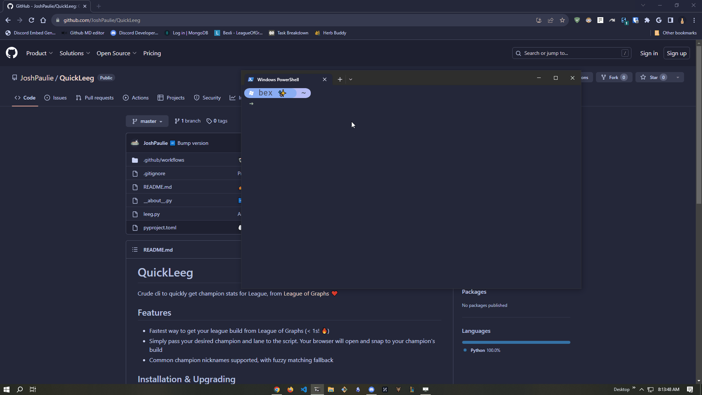

# QuickLeeg
Crude cli to quickly get champion stats for League, from [League of Graphs](https://www.leagueofgraphs.com/) ❤️



## Features
- Fastest way to get your league build from League of Graphs (< 1s! 🔥)[^1]
- Simply pass your desired champion and lane to the script. Your browser will open and snap to your champion's build
- Common champion nicknames supported, with fuzzy matching fallback

[^1] This is tongue in cheek, it obviously doesn't take much to load a webpage

## Installation & Upgrading
> ⭐ Star the repo if you're interested in me publishing QuickLeeg to PyPi

```console
pipx install git+https://github.com/JoshPaulie/QuickLeeg.git
```

```console
pipx upgrade QuickLeeg
```

## Usage
```console
leeg [-h] [-r RANK] champ lane
leeg aatrox top --rank gold
leeg fizz aram
```

## Why does this script exist?
League of Graphs is easily the superior league build site. Despite this, getting to your favorite champion's stats is one too many clicks for me. You have to
1) Navigate to League of Graphs
2) Click search box
3) Enter champ name
4) Specify lane
5) Specify rank

This script simply does this in one step. 

---

### Disclaimer
This script/package & author have nothing to do with League of Graphs.
I'm just a lazy-bones and like to save steps on frequently repeated tasks

But I am interested in making an official **League of Graphs** TUI app if you're interested, Trebonius 🤓